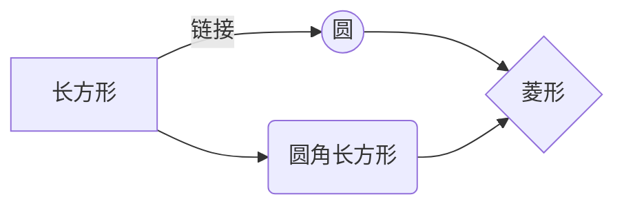

# <center>简介构建中</center>

```html
<html>
    <head>
</html>
```
***

## 测试


这是一行**强调**的测试

</i><i class="fa fa-camera-retro"></i>

> [!NOTE]
> An alert of type 'note' using global style 'callout'.

> [!attention]
> An alert of type 'note' using global style 'callout'.

> Do not talk.  
See the section on [`code`](#code).

这是一个链接 [Markdown语法](https://markdown.com.cn "最好的markdown教程")。

[hobbit-hole][1]

[1]: <https://en.wikipedia.org/wiki/Hobbit#Lifestyle> 'Hobbit lifestyles'

At the command prompt, type `nano`.这是`测试`


\* Without the backslash, this would be a bullet in an unordered list.  
* Without the backslash, this would be a bullet in an unordered list.

http://images.google.com/images?num=30&amp;q=larry+bird

## 来点C

~~~js
class Circle {
    constructor({ origin, speed, color, angle, context }) {
        this.origin = origin
        this.position = { ...this.origin }
        this.color = color
        this.speed = speed
        this.angle = angle
        this.context = context
        this.renderCount = 0
    }

    draw() {
        this.context.fillStyle = this.color
        this.context.beginPath()
        this.context.arc(this.position.x, this.position.y, 2, 0, Math.PI * 2)
        this.context.fill()
    }

    move() {
        this.position.x = (Math.sin(this.angle) * this.speed) + this.position.x
        this.position.y = (Math.cos(this.angle) * this.speed) + this.position.y + (this.renderCount * 0.3)
        this.renderCount++
    }
}
~~~

~~~matlab
X = [ones(m, 1), data(:,1)]; % Add a column of ones to x
theta = zeros(2, 1); % initialize fitting parameters

% Some gradient descent settings
iterations = 1500;
alpha = 0.01;

fprintf('\nTesting the cost function ...\n')
% compute and display initial cost
J = computeCost(X, y, theta);
fprintf('With theta = [0 ; 0]\nCost computed = %f\n', J);
fprintf('Expected cost value (approx) 32.07\n');
~~~

~~~cpp
#include <stdio.h>
int main(){
    char *s = "Hello World\0";
    char s1[] = "Hello World\0";
    s1[0] = 'B';
    
    printf("s=%s\n",s);
    printf("s1=%s\n",s1);
    printf("Here!s1[0]=%c\n",s1[0]); 
    return 0;
}
~~~

~~~markdown
> 组织构建[网站]

+ GitHub Pages(国外): https://sklearn.apachecn.org
+ Gitee Pages(国内): https://apachecn.gitee.io/sklearn-doc-zh

> 第三方站长[网站]

+ sklearn 中文文档: http://www.scikitlearn.com.cn
+ 地址A: xxx (欢迎留言，我们完善补充)
~~~

~~~python
from functools import reduce

DIGITS = {'0': 0, '1': 1, '2': 2, '3': 3, '4': 4, '5': 5, '6': 6, '7': 7, '8': 8, '9': 9}

def char2num(s):
    return DIGITS[s]

def str2int(s):
    return reduce(lambda x, y: x * 10 + y, map(char2num, s))
~~~

## 制表

| Syntax      | Description |
| ----------- | ----------- |
| Header      |    [Title][1]    |
| Paragraph   | Text        |


| Syntax      | Description | Test Text     |
| :---        |    :----:   |          ---: |
| Header      | Title       | Here's this   |
| Paragraph   | Text        | And more      |

~~~css
"firstName": "John",
"lastName": "Smith",
"age": 25
~~~

Here's a simple footnote,[^2] and here's a longer one.[^bignote]

---

[^2]: 'This is the first footnote.

[^bignote]: Here's one with multiple paragraphs and code.

    Indent paragraphs to include them in the footnote.

    `{ my code }`

    Add as many paragraphs as you like.

~~世界是平坦的~~

- [x] Write the press release
- [ ] Update the website
- [ ] Contact the media

去露营了！ :tent: 很快回来。

真好笑！ :joy:


## 新的实验
H~2~O is是液体。  
您可以使用渲染LaTeX数学表达式 [KaTeX](https://khan.github.io/KaTeX/):

Gamma公式展示 $\Gamma(n) = (n-1)!\quad\forall
n\in\mathbb N$ 是通过欧拉积分

$$
\Gamma(z) = \int_0^\infty t^{z-1}e^{-t}dt\,.
$$

> 你可以找到更多关于的信息 **LaTeX** 数学表达式[here][1].


​```dot
digraph demo{
    A->B[dir=both];
    B->C[dir=none];
    C->D[dir=back];
    D->A[dir=forward];
}
​```




$$
\left[
\begin{matrix}
 1      & 2      & \cdots & 4      \\
 7      & 6      & \cdots & 5      \\
 \vdots & \vdots & \ddots & \vdots \\
 8      & 9      & \cdots & 0      \\
\end{matrix}
\right]
$$

