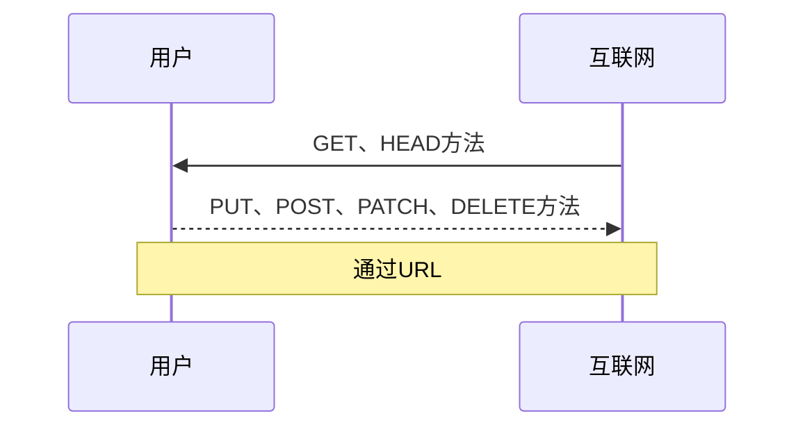
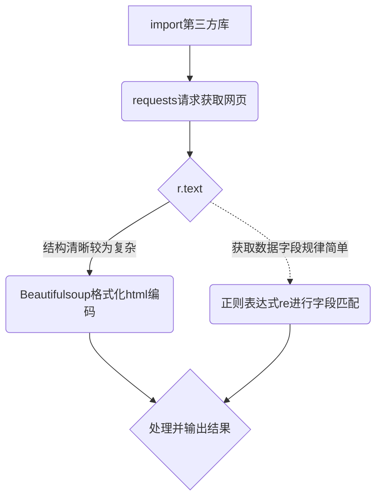
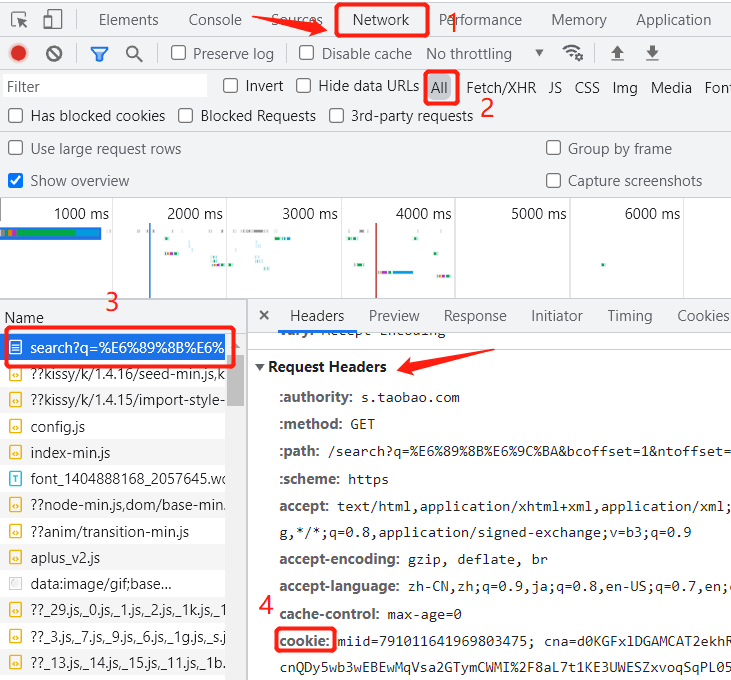

# Python网络爬虫

现在有关爬虫的相关知识，网络上挺多的。完全没有相关知识的同学可以去看[Python网络爬虫与信息提取](https://www.bilibili.com/video/BV1qs411n79v?p=1)网课，北理老师讲的，比较详细。本文也是参照此视频形成，代码案例目前为止有效，可以模仿学习。

## 1.什么是网络爬虫

> 这里主要是个人简单应用，目前大型乃至多样化的爬虫有很多，技术也比较成熟，不做考虑。

* 网络爬虫用于定向网络数据爬取，进行网络分析。

* 可以用来**批量下载**资源，音视频、文字、数据等。

* 举个例子。

    > 比如你想要获得一支股票的涨跌情况，在网络上你只需要找到对应的股票详情页面即可。那么当你想批量获得众多股票的情况，你可以选择一个个找到对应详情（感觉还可以应对）。但是当你想这些股票做对比，或者来分析以便决策，是不是感觉要头大了。

    那么利用爬虫就可以在短时间里快速请求访问想要获取的网站数据，并返回结果。尤其当你需要的数据量庞大、访问需求高的时候，爬虫是个一劳永逸的手段（只要源数据网站界面组织架构不变，一般不会有很大修改）。

## 2.网络资源请求

### HTML语言
网页文件通常.html(超文本标记语言) .xml(可扩展标记语言)等结尾，就像其他文件格式一样，这只是文件的一种组织方式，浏览器可解析并打开网页文件。随便打开一个网页，按F12即可看到网页源代码。爬虫所要做得事情简单来说就是访问网页，请求这个网页的源代码，然后通过一些手段搜索并整理出自己所要的数据。

下面是一个简单的网页代码（可自行复制后形成后缀为html的文档，用浏览器打开试试）。有关html详细知识可以点[这里](https://www.runoob.com/html/html-tutorial.html)。

~~~html
<!DOCTYPE html>
<html>
<head>
<meta charset="utf-8">
<title>测试</title>
</head>
<body>
    <h1>这是1号标题</h1>
    
段落是这样的

</body>
</html>
~~~

> [!TIP]
> 可以和熟悉的word文档进行类比，只不过html文本的格式通过这样`<title></title>`的标签来定义，而后由浏览器进行解析。word中格式所见即所得罢了

### 网络与用户请求

* HTTP协议：Hypertext Transfer Protocol 超文本传输协议。是一种基于“请求与相应”模式、无状态的应用层协议（工作在THP协议之上），用于实现正常网络通信。由于安全性问题，目前网站普遍采用HTTPS协议，用于加密浏览器和服务器之间的通讯。

* URL：Uniform Resource Location 统一资源定位符。就是我们俗称的网址，可以类比电脑本地存储资源的路径，在本地如果想访问某一文件，只要找到对应路径即可。在网络上的资源也是如此，通过URL实现精准请求。

* HTTP协议对资源的操作
    * **GET**：请求URL对应资源
    * **HEAD**：获取URL对应资源的头部信息
    * POST：附加新的数据
    * PUT：提交覆盖URL原有资源
    * PATCH：更改部分资源
    * DELETE：请求删除URL对应资源

## 3.requests库

[Requests](http://www.python-requests.org)是非常强大的第三方库，满足HTTP协议对网络资源的请求操作。

### 请求方法

* **request方法**：是requests库的最基本请求方法，另外7种（包括HTTP协议支持的6种 + OPTIONS方法）均是通过调用request方法来实现。

* `requests.request(method, url, **kwargs)`
    - method为上述7种方法
    - url为对应资源链接
    - \**kwargs：控制访问参数，一共有13个，较为常用的几个是params、data、json、**headers**、**cookies**、auth、**timeout**等

* `requests.get(url, params, **kwargs)`是最常用的方法。
    > [!NOTE]
    > 服务器严格管控修改数据库内容的操作，PUT、POST、PATCH、DELETE方法基本不会用到，最常用的就是GET方法，其次HEAD方法。

* 另外6种方法略

### 调用requests库

* **r = requests.get(url)**

    - r: 返回的Response对象
    - requests：构建向服务器请求资源的Request对象

* Response对象的五大属性

    | 名称     | 作用 |
    | :---        |:---   |
    | r.status_code   |返回请求状态码，200为成功，404失败，（或其他数字）    |
    | r.text   | url对应页面内容，字符串形式  |
    | r.encoding | 从HTTP header中猜测的内容编码方式 |
    | r.apparent_encoding | 从相应内容分析出的编码方式  |
    | r.content  | 相应内容的二进制形式（还原图片格式）  |

### Requests异常

网络连接有风险，异常处理很重要。

| 异常类型     | 详情 |
| :---        |:---   |
| requests.ConnectionError   |网络连接异常，DNS查询失败，拒绝连接|
| requests.HTTPError   | HTTP错误  |
| requests.URLRequired | URL缺失 |
| requests.TooManyRedirects | 超过最大重定向次数  |
| requests.ConnectTimeout  | 连接远程服务器超时  |
| requests.Timeout  | 请求URL超时异常  |

* r.raise_for_status() 如果返回状态码不是200，引发一个HTTPError

## 4.Robots协议

* 滥用爬虫容易引发风险，比如**骚扰**、**法律风险**、**隐私泄露**等等。

* 当前限制网络爬虫的几个方法

    1. 来源审查，判断用户代理User-Agent，通过检查HTTP协议头部信息实现
    2. 发布公告robots协议，告诉爬虫哪些内容可以抓取，哪些不行
    3. 其他反爬机制（比如需要cookies，锁定ip等）

* 类人类行为可不参考Robots协议。可以在网站根目录'/'下加上'robots.txt'查看下协议，建议性协议而非约束性，可不遵守，但存在法律风险。

## 5.爬虫实践（requests库）

### 结构形式

### 代码实践

#### 获取中国大学排名

* 数据来源：[2021中国最好大学排名](https://www.shanghairanking.cn/rankings/bcur/202111)

* 需求：获取并输出各个大学排名、名称、总评分三栏数据

1. 引入requests、BeautifulSoup库

~~~python
import requests
import bs4
from bs4 import BeautifulSoup
~~~

2. 定义请求网页函数get_html()

~~~python
def get_html(url):
    try:
        kv = {"User-Agent": "Mozilla/5.0"}
        r = requests.get(url, headers=kv, timeout=30)
        r.raise_for_status()
        r.encoding = r.apparent_encoding
        # print(r.request.headers['User-Agent'])
        return r.text
    except:
        return ''
~~~

> [!ATTENTION]
> - 头部信息headers的"User-Agent"改成了"Mozilla/5.0"，Mozilla浏览器种类，/5.0是版本，也可以模拟Chrome、safari等浏览器。如果不更改，request会用默认采用自己的代理，比如我不更改用户代理，再利用`r.request.headers`查看request请求的头部信息时，发现使用的是`'User-Agent': 'python-requests/2.24.0'`，这种会被某些网站拦截访问，所以建议模拟一个浏览器进行request请求。
> - `r.encoding = r.apparent_encoding`根据内容解析编码，使r.text解析出正确内容。可以试试爬取百度首页，会发现r.encoding = 'ISO-8859-1'（这种编码解析不了中文，而且如果网页header中没有charset属性，默认也是它）；r.apparent_encoding = 'utf-8'。后者的值赋给前者后，r.text就能正常解析了。
> - try……except 结构用于处理异常。

3. 排除所需数据中的空格和换行字符

~~~python
def get_str(string):
    re_str = ''
    for i in string:
        if i != ' ' and i != '\n':
            re_str += i
    return re_str
~~~

4. 搜索筛选html中大学排名、名称、总分的数据

~~~python
def fill_list(ulist, html):
    soup = BeautifulSoup(html, 'html.parser')
    for tr in soup.find('tbody').children:
        if isinstance(tr, bs4.element.Tag):
            tds = tr('td')
            rank = list(tds[0].strings)[0]
            grades = list(tds[4].strings)[0]
            Rank_list = get_str(rank)
            Grades = get_str(grades)
            ulist.append([Rank_list, tds[1].a.string, Grades])
~~~

> [!ATTENTION]
> - BeautifulSoup(html, 'html.parser')使得r.text能够以html的格式读懂，形成树形结构，并产生BeautifulSoup、Tag等对象。Tag对象对应的就是html中的各类格式标签

这种。
> - 这一步需要根据不同网站具体而定，在本例中，通过查看网站源代码，可以看到标签'tbody'下子标签'td'中保存着所需要的数据，找到并保存给自定变量，最后形成一个数据集。

5. 输出结果函数

~~~python
def print_list(ulist, num):
    tplt = '{:^4}\t{:^6}\t{:^0}'
    print('{:^4}\t{:^6}\t{:^0}'.format('Rank', 'Grades', 'Name'))
    for i in range(num):
        u = ulist[i]
        print(tplt.format(u[0], u[2], u[1]))
~~~

6. 主函数（调用以上函数实现）

~~~python
if __name__ == "__main__":
    unifo = []
    url = 'https://www.shanghairanking.cn/rankings/bcur/202111'
    html = get_html(url)
    fill_list(unifo, html)
    print_list(unifo, 30)
~~~

7. 结果如下

|Rank|	Grades	|Name|
| :---  |:--- |:--- |
| 1  |	969.2 	|清华大学 |
|2  |	855.3 	|北京大学 |
|3  |	768.7 	|浙江大学 |
|4  |	723.4 	|上海交通大学| 
|...| ...|...|

#### 获取淘宝搜索“手机”后的商品

* 需求：价格和相应商品名称

* 不同点
    
    - 没有用BeautifulSoup，但是使用了正则表达式re库进行匹配搜索
    - 除了设置用户代理，还得带上cookie（淘宝维护之后都需要cookie了）
    - 其余都是常规手法

* 查找cookie，并在代码相应位置更换。打开淘宝搜索网页，F12查看源码，按下图操作。

    

* 爬虫源码

~~~python
import requests
import re

def getHTMLText(url):
    try:
        header = {
                  'user-agent': 'Mozilla/5.0 (Windows NT 10.0; Win64; x64) AppleWebKit/537.36 (KHTML, like Gecko) Chrome/80.0.3987.132 Safari/537.36',
                  'cookie': '.....'} # cookie请更换为自己浏览器上的cookie字符串

        r = requests.get(url, headers=header)
        # print(r.request.headers)
        r.raise_for_status()
        r.encoding = r.apparent_encoding

        return r.text
    except:
        return ""

def parsePage(ilt, html):
    try:
        plt = re.findall(r'\"view_price\":\"[\d+\.]*\"', html)
        tlt = re.findall(r'\"raw_title\"\:\".*?\"', html)
        for i in range(len(plt)):
            price = eval(plt[i].split(':')[1])
            title = eval(tlt[i].split(':')[1])
            ilt.append([price, title])
    except:
        print("F")

def printGoodsList(ilt):
    tplt = "{:4}\t{:8}\t{:16}"
    print(tplt.format("序号", "价格", "商品名称"))
    count = 0
    for g in ilt:
        count = count + 1
        print(tplt.format(count, g[0], g[1]))

def main():
    goods = '手机'
    depth = 2
    start_url = "https://s.taobao.com/search?q=" + goods
    infoList = []
    for i in range(depth):
        try:
            url = start_url + '&s=' + str(45 * i)
            html = getHTMLText(url)
            parsePage(infoList, html)
        except:
            continue
    printGoodsList(infoList)

main()
~~~

## 待续~

***
