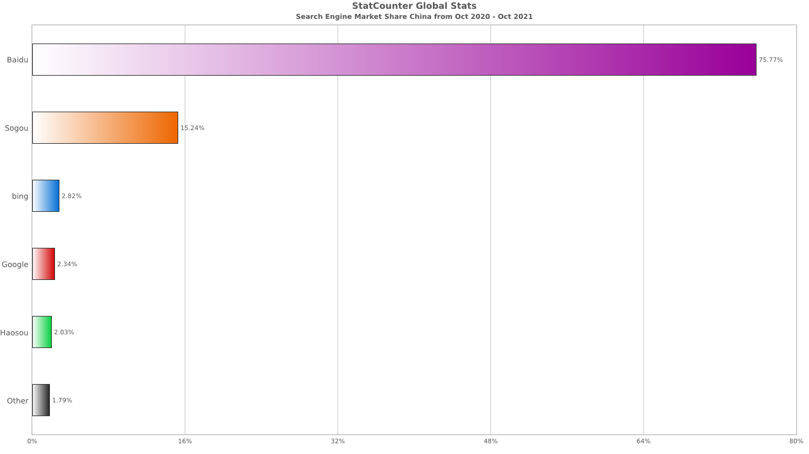
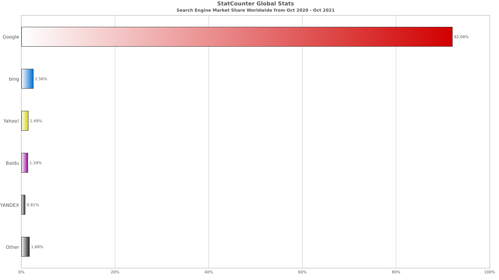

# 带着“好”问题去问“对”的人

> 问题其实时刻都会产生，每个人都可能是提问者或者被提问者。作为被提问者时，如果提问者的问题太不走心，想必都能体会到其中的滋味。那么作为提问者时，就需要点到问题的关键，知道自己要问什么。提出一个好问题，才能有更高的解决效率，你好他/她也好。

## 问什么  
    
**1. 务必首先尝试自己解决。**

求人不如求己。遇到任何问题，首先要做的是自己尝试解决，可以先在[搜索引擎](/essays/problem_solve?id=问搜索引擎)上搜索。保证自己摸索过一到多遍后，再选择去请教别人。没有做过任何的尝试和准备就直接开问，真的只是耽误时间而已，而且显得不负责任。

2. 形成并提炼问题。

    * 具体化、细节化。
    > 不要提“怎样学游泳？”“如何学python？”这类毫无价值的问题。现在网络这么发达，提这种问题证明：你不仅是个小白还是个懒人。或许你是真的想让别人带你进入新的领域，但是这种问题太过笼统，一时半会儿解决不了。

    * 给足已知、足够精简。
    > 问题描述及相关条件越充足，越能提高效率。当然也要做到精简，别把问题当小作文来写。

    * 表意准确、无歧义。
    > 字面含义，尽量不要有错字、歧义。确定是一个正确的问题题干。

3. 自问自答。

自己先问自己一遍经过步骤2形成的问题，确定有无补充、更改。如果发现自己都不知云，就别去耽误别人时间了。

## 怎么问

* 搞明白自己想**问什么**。这是最起码的要求，亦是对回答者的尊重。

* **认真和反馈**。问问题的时候认真听别人讲，可以适当给予一些反馈，表示哪里听懂了，哪里有疑问等。别人付出了时间精力，不要让人觉得你好像无所谓，像在消遣他/她。

* **谦虚**。既然选择请教别人，就别搞得自己什么都会一样，那样只会让人感觉在和一个小“八嘎”讲道理，容易伤和气。

* 如果别人也不懂、不愿解答或是没空解答，请另寻他人或者等待。谁也没有必须要为你解答的义务。

## 问谁

* 八仙过海，各显神通了。同学、朋友、老师、甚至相应圈子或者领域的人都可以，但是术业有专攻，要搞清楚对象。不要向数学老师请教体育问题（虽然不排除数学老师也是体育能手）🤣。

## 问搜索引擎

搜索引擎是个好帮手，理论上来讲大部分问题在Internet上基本都能找到解决方案。

* 常用高级搜索方法

    > 搜索出结果后，人们往往只会看前几页内容，所以提高搜索精度很有必要。以下提供的高级搜索方法，大多数搜索引擎下都是通用的。 

    * `" "`中包括搜索内容，精确短语搜索

    * `AND`、`OR`，字面意思，并、或逻辑关系

    * `-` 排除不想要的内容，如`计算机 -广告`

    * `关键词 intitle: 关键词` 限定网页标题内容，如`课程 intitle: 计算机`

    * `关键词 site: 地址` 特定网站内搜索内容，如`土水 site: tsinghua.edu.cn`

    * `关键词 filetype: 文件类型` 特定类型内容，pdf、doc等

> [!NOTE]
> 以上仅列举几个较为常用的高级搜索方法，其他方法可自行搜索。另外像谷歌、百度等搜索引擎提供高级搜索界面，所以也可以在高级搜索面板中操作，不过一般用不到。

* 常用搜索引擎

    * 国内

    

    Source 1: [StatCounter Global Stats - Search Engine Market Share China](https://gs.statcounter.com/search-engine-market-share/all/china#monthly-202010-202110-bar)
    

    * 全球
    
    

    Source 2: [StatCounter Global Stats - Search Engine Market Share Worldwide](https://gs.statcounter.com/search-engine-market-share#monthly-202010-202110-bar)

    * 推荐  
    Bing搜索在国内也能用，从搜索结果上来看，一般会比百度得出更加有效的结果。  
    在英文搜索方面，Bing要比百度优势更大。  
    当然，如果科学上网，Google搜索也是不错的选择。

* 延伸
     
    * 搜索引擎的三种工作方式：    
        1. 全文搜索（Full Text Search Engine)
        2. 目录索引类搜索（Search Index/Directory)
        3. 元搜索（Meta Search Engine)

    * 第二代搜索引擎（Google、Bing、Baidu...属于全文搜索方式）
